# CG1111A mBot Maze Solver

An autonomous mBot that navigates through a maze using ultrasonic and infrared sensors, detects coloured papers using LDR-based colour sensors, and executes specific actions based on the detected colours.

## 📋 Project Overview

This project involves programming and modifying an mBot to autonomously:
- Navigate through a maze while avoiding walls using ultrasonic and IR sensors
- Detect black stop lines using line follower sensors
- Identify coloured papers (Red, Green, Blue, Orange, Purple, White) using custom LDR-based colour sensors
- Execute specific actions based on the colour detected
- Complete the maze and play a celebratory Star Wars theme


## 🎯 Project Objectives

### Primary Goals
- Autonomous maze navigation with real-time wall detection and adjustment
- Accurate colour paper detection using custom RGB LED and LDR circuit
- Execute predefined actions based on detected colours
- Successfully complete the maze course

### Technical Challenges
- Implement custom IR proximity sensor for right wall detection
- Design and calibrate LDR-based colour sensor with RGB LEDs
- Handle ambient light variations affecting sensor readings
- Optimize sensor mounting positions for better responsiveness

## 🤖 System Architecture

### Overall Algorithm Flow

```mermaid
flowchart TD
    A([Start]) --> B[Initialize Sensors & Motors]
    B --> C[Read Ultrasonic Sensor - Left Wall]
    C --> D[Read IR Sensor - Right Wall]
    D --> E{Too Close to<br/>Left Wall?}
    E -->|Yes| F[Adjust Right]
    E -->|No| G{Too Close to<br/>Right Wall?}
    F --> H[Read Line Sensor]
    G -->|Yes| I[Adjust Left]
    G -->|No| J[Move Forward]
    I --> H
    J --> H
    H --> K{Black Line<br/>Detected?}
    K -->|No| C
    K -->|Yes| L[Stop Motors]
    L --> M[Turn On Colour Sensor Circuit]
    M --> N[Shine Red LED → Read LDR]
    N --> O[Shine Green LED → Read LDR]
    O --> P[Shine Blue LED → Read LDR]
    P --> Q[Calculate Manhattan Distance]
    Q --> R[Identify Colour]
    R --> S{Colour = White?}
    S -->|Yes| T[Play Star Wars Theme]
    T --> U([End])
    S -->|No| V[Execute Action Based on Colour]
    V --> C
```



## 🔧 Hardware Components

### Sensors Implementation

#### 1. Ultrasonic Sensor (HC-SR04)
- **Location:** Left side of mBot
- **Function:** Measures distance to left wall
- **Port:** RJ25 Port 2 (Digital I/O)
- **Principle:** Emits 42kHz ultrasonic pulses, measures time-of-flight
- **Formula:** Distance = (Speed of Sound × Time) / 2
- **Threshold:** Adjusts right when distance ≤ 8 cm

#### 2. IR Proximity Sensor (Custom Built)
- **Location:** Right side of mBot (protruding forward)
- **Function:** Detects presence of right wall
- **Components:** IR emitter (120Ω resistor) + IR detector (10kΩ resistor)
- **Port:** RJ25 Port 3 (Analog A2)
- **Improvements:**
  - Extended optimal working range from 4 cm to 8 cm
  - Baseline IR measurement to handle ambient light variation
  - Forward positioning for better responsiveness
- **Threshold:** Adjusts left when IR value ≤ 225

#### 3. Line Follower Sensor
- **Location:** Front of mBot, facing downward
- **Function:** Detects black stop lines before coloured papers
- **Port:** RJ25 Port 1 (Digital I/O)
- **Components:** 2× IR transmitter-receiver pairs

#### 4. LDR Colour Sensor (Custom Built)
- **Location:** Underside of mBot with protective black skirting
- **Components:**
  - 1× Light Dependent Resistor (5-100kΩ)
  - 3× RGB LEDs (Red: 390Ω, Green: 470Ω, Blue: 470Ω)
  - 1× 9.1kΩ resistor in series with LDR
  - HD74LS139P 2-to-4 decoder IC chip
- **Port:** RJ25 Port 4 (Analog A0, A1, A3)
- **Detection Method:** Manhattan Distance algorithm
- **Colours Detected:** Red, Green, Blue, Orange, Purple, White

### Circuit Design

#### 2-to-4 Decoder (HD74LS139P)
Used to expand limited analog pins and control multiple components:
- Y0: IR Emitter (via L293D motor driver)
- Y1: Green LED
- Y2: Blue LED  
- Y3: Red LED

**Logic Table:**

| A0 (1B) | A1 (1A) | Active Output |
|---------|---------|---------------|
| LOW     | LOW     | Y0 (IR)       |
| HIGH    | LOW     | Y1 (Green)    |
| LOW     | HIGH    | Y2 (Blue)     |
| HIGH    | HIGH    | Y3 (Red)      |

## 💻 Software Implementation

### Colour Detection Algorithm

#### Step 1: Calibration
```cpp
// Obtain white and black reference values
setBalance(); // Records whiteArray and blackArray

// Calculate grey difference
greyDiff[c] = whiteArray[c] - blackArray[c];
```

#### Step 2: Normalization
```cpp
// Convert raw RGB (377-915) to standard range (0-255)
normalizedRGB = (rawValue - blackArray[c]) * 255 / greyDiff[c];
```

#### Step 3: Averaging
```cpp
// Reduce noise by averaging multiple readings
getAvgReading(int times);
```

#### Step 4: Manhattan Distance
```cpp
// Calculate distance to each calibrated colour
distance = |R2 - R1| + |G2 - G1| + |B2 - B1|

// Colour with smallest distance is detected colour
```

### IR Ambient Light Compensation
```cpp
// Record baseline without IR emitter
record_baseline();

// Measure with IR emitter on
ir_value = analogRead(IR_PIN);

// Calculate difference (updated every 10 iterations)
final_value = ir_value - baseline_value;
```

## 📊 Technical Specifications

### Sensor Characteristics

| Sensor Type | Range/Threshold | Response Time | Accuracy |
|-------------|----------------|---------------|----------|
| Ultrasonic | ≤ 8 cm (too close) | ~20 ms | ±0.3 cm |
| IR Proximity | ≤ 225 (analog value) | ~5 ms | Varies with ambient light |
| Line Follower | Binary (line/no line) | <1 ms | High |
| LDR Colour | 0-255 (normalized RGB) | ~200 ms per colour | Depends on calibration |

### Resistor Optimizations

#### IR Circuit
- **Emitter:** 120Ω (limits current to <50mA)
- **Detector:** 10kΩ (extends working range to 8 cm)

#### LDR Circuit
- **LDR Series:** 9.1kΩ (increases sensitivity and RGB range)
- **Red LED:** 390Ω
- **Green LED:** 470Ω
- **Blue LED:** 470Ω

## 🎨 Colour Detection Actions

| Detected Colour | Action Executed |
|----------------|-----------------|
| Red | [Specific action as per project requirements] |
| Green | [Specific action as per project requirements] |
| Blue | [Specific action as per project requirements] |
| Orange | [Specific action as per project requirements] |
| Purple | [Specific action as per project requirements] |
| White | Stop motors + Play Star Wars theme + LED colour display |

## 🔨 Design Optimizations

### 1. Sensor Mounting
- **IR Sensor:** Repositioned to protrude forward, aligning with ultrasonic sensor for better front-right wall detection
- **LDR Sensor:** Mounted underneath with black skirting and 4-flap chimney to block ambient light
- **All LEDs positioned below LDR** to prevent direct light capture

### 2. Wall Detection Strategy
- **Dual-sensor approach:** Ultrasonic (left) + IR (right) for comprehensive wall detection
- **Dynamic adjustment:** Continuous correction prevents wall collisions
- **Threshold tuning:** Optimized through extensive testing

### 3. Colour Sensor Improvements
- **Lower resistance (9.1kΩ):** Expands raw RGB range for better colour differentiation
- **Pre-run calibration:** Adapts to daily ambient light conditions
- **Manhattan distance:** Simple yet effective colour matching algorithm

## 🚧 Challenges & Solutions

### Challenge 1: Ambient IR Interference
- **Problem:** External IR sources (sunlight, artificial light) affected sensor readings
- **Solution:** Implemented baseline measurement by turning IR emitter off, then subtracting baseline from active reading

### Challenge 2: Turning Radius
- **Problem:** Forward-mounted IR sensor increased turning radius, causing wall collisions during U-turns
- **Solution:** Repositioned breadboard orientation or moved sensors forward while maintaining detection accuracy

### Challenge 3: Colour Sensor Consistency
- **Problem:** Small RGB range caused similar Manhattan distances between colours
- **Solution:** 
  - Reduced LDR resistor from 100kΩ to 9.1kΩ
  - Calibrated before each session
  - Added averaging function to smooth readings

### Challenge 4: Light Contamination
- **Problem:** Ambient light and LED crosstalk affected LDR readings
- **Solution:** Constructed black skirting with 4-flap chimney and positioned all LEDs below LDR

## 📁 Repository Contents

```
├── README.md
├── CG1111A Project Report.pdf
└── Code/
    ├── MBot_Main_final.ino          # Main control logic
    ├── LDR_final.ino           # Colour sensor functions
    └── Motor_final.ino         # Motor control functions
```

## 🧪 Testing & Calibration

### Pre-Run Checklist
1. **White/Black calibration:** Run `setBalance()` to obtain reference arrays
2. **Colour calibration:** Test all 6 colours and store RGB values in `calibratedColors[][]`
3. **IR baseline:** Update ambient IR baseline for current lighting conditions
4. **Sensor check:** Verify ultrasonic, IR, and line sensors are functioning
5. **Motor test:** Confirm forward, left, and right adjustments work correctly

### Calibration Process
```cpp
// 1. Place white paper under LDR
// 2. Record whiteArray values
// 3. Place black paper under LDR
// 4. Record blackArray values
// 5. Calculate greyDiff = whiteArray - blackArray
// 6. Store values in code (comment out setBalance() for graded run)
```

## 🎓 Key Learnings

1. **Sensor Fusion:** Combining multiple sensor types (ultrasonic + IR) provides more robust navigation
2. **Ambient Compensation:** Always account for environmental variations in sensor design
3. **Iterative Calibration:** Pre-run calibration is essential for consistent colour detection
4. **Physical Positioning:** Sensor mounting location significantly impacts performance
5. **Algorithm Selection:** Simple algorithms (Manhattan distance) can be highly effective
6. **Noise Reduction:** Averaging multiple readings improves sensor reliability
7. **Circuit Optimization:** Resistor values directly affect sensor sensitivity and working range

## 🏆 Performance Results

- ✅ Successfully completed maze navigation
- ✅ Accurate colour detection (6 colours)
- ✅ Smooth wall-following with minimal collisions
- ✅ Reliable stop line detection
- ✅ Successful action execution based on colours
- 🎵 Star Wars theme plays upon white paper detection

## 👥 Team Contributions

| Name | Responsibilities |
|------|-----------------|
| Tan Chun Liang | LED & LDR Circuit Design, Black Skirting Design |
| Wang Chuhao | LED & LDR Implementation, Code Development & Debugging |
| Wang Zaixi | Ultrasonic & IR Sensors, Calibration Code, mBot Safekeeping |
| Wang Jiawei | Ultrasonic & IR Sensors, Project Report Documentation |

## 🔗 References

- mBot MeMCore Library Documentation
- Arduino Core Library
- Studio 12 Handout - IR Sensor Implementation
- HD74LS139P Decoder Datasheet
- HC-SR04 Ultrasonic Sensor Datasheet

## 📝 License

This project was completed as part of the CG1111A course curriculum at the National University of Singapore.

## 🙏 Acknowledgments

- NUS CG1111A Teaching Team
- Lab instructors and teaching assistants
- Makeblock mBot platform and community

---

*For complete circuit diagrams, detailed code implementation, and calibration data, please refer to the full project report.*
